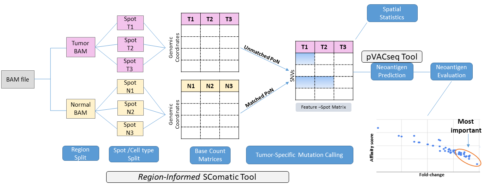

# NeoSpan
Neoantigen Prediction using Spatial Multi-Omic data - Pipeline



## ABOUT
This pipeline allows end-to-end analysis for neoantigen prediction using Spatial Multi-Omic data.
It incorporates spatial information along with (pathologist) region annotation (e.g. tumor vs normal) to identify, highlight and rank/evaluate potential neoantigens.

The pipeline can be divided into three primary categories:
1) Mutation calling (SNV detection) using (pathologist) region annotation and spatial information
2) Neoantigen prediction
3) Ranking and evaluation of the detected potential neoantigens.

The mutation calling is performed by applying a modified version of the **[SComatic tool](https://github.com/cortes-ciriano-lab/SComatic)**. The **SComatic tool** compares tumor cells with non-matched publicly available non-neoplastic samples. Instead, our approach uses tumor and normal cells from the same individual providing additional insights into personalized germline variants. **Note:** For our example, the annotations where performed by a pathologist. However, any classification method can work as well.

The neoantigen prediction can be utilized by several methods, each one corresponding to additional data available in our sample. 

<ol type="a">
  <li>If there is DNA Information (WGS or WES), then accurate HLA typing is possible. Therefore, we recommend to use [NetMHCpan](https://services.healthtech.dtu.dk/services/NetMHCpan-4.1/), or, equivalently for end-to-end analysis the [pVACtools](https://github.com/griffithlab/pVACtools). **Optimal method.**</li>
  <li>If no complete HLA gene coverage is ensured, there are the following options available:</li>
  <li>Third item</li>
</ol>

a) 
b) 

  1) RNA-seq-based HLA typing. This can be done with [OptiType](https://github.com/FRED-2/OptiType). **Can provide an estimation of HLA, but is less accurate than method (a) when complete HLA typing is possible.**
  2) Population-Based HLA Estimation. This can be extracted from publicly available HLA databases (e.g. http://www.allelefrequencies.net/). **Less patient-specific. Should be used only under the assumption that the ancestors share common HLA alleles.**
  3) Pan-MHC approach for neoantigens. This method performs predictions across multiple HLA alleles. **Less accurate than allele-specific methods**
  
c) If no HLA data is available, then [DeepNovo](https://github.com/nh2tran/DeepNovo). This method applies a deep-learning tool for peptide identification without using HLA data. **Less preferrable than the (a) and (b) when HLA typing is possible, since it yields in lower accuracy (HLA binding is a key factor in immune response) and less clinical validation.**

To rank and evaluate the detected potential neoantigens, we apply spatial statistics, differential gene expression analysis, and comparisons/visualizations based on metrics such as affinity scores and the fold-changes.

## Features
- Split/Filter the BAM file based on the regions annotated by the pathologist. It is strongly recommended to include normal (non-tumor) regions.
- Create a -personalized- Panel of Normals (PoN) using the BAM file associated with the normal region.
- Within each non-normal region, mutation calling (SNV detection) incorporating spatial and/or cell-type information (Modified, Region-Informed **SComatic** tool). The PoN created in the previous step is used for further artifact and germline variant exclusion.
- For the non-normal regions, construct region-specific feature-spot matrices. Those matrices will not contain SNVs that appear in the normal region since they were removed in the previous step.
- Neoantigen prediction using the **pVACseq**.
- DGE analysis between mutated and unmutated spots, within the tumor region.
- Spatial statistics.

## Data requirements
- **BAM** file with a barcode tag (spot and/or cell).
- **Pathologist annotation (csv)**: Map each barcode to a specific region.
- **Spot clustering (csv)**: (Optional) To perform mutation calling within clusters of spots
- **Cell type annotation (csv)** (Optional) Only possible when we have single cell information apart from the spatial omics
- **Spot to cell mapping (csv)** (Optional) Only needed if there is both spot and cell-type information

## Installation and Requirements
It is strongly suggested to work in a Conda virtual environment.

Create a Conda virtual environment:
```bash
conda create -n vNS python=3.10
conda activate vNS
```
For further requirements regarding the SComatic tool, please refer to [SComatic README requirements](https://github.com/cortes-ciriano-lab/SComatic/blob/main/README.md#installation-and-requirements).

# Mutation calling (SNV detection) using pathologist region annotation, spatial and/or single cell information.

We show below how to run NeoSpan for the detection of SNVs using pathologist region annotation. It is a "two-stage" approach, which will be described bellow:

## Step 1: Split/Filter the BAM file based on the pathologist region annotation.
This step splits the BAM file into region-specific BAM files. To do so, the user provides a file mapping each spot barcode to a specific region. The script reads the unique regions that appear in the file, creates a new BAM file for each one separately, and writes it in an output directory provided by the user.

The step requires two data types as input:
* Aligned sequencing reads in BAM format for all spots analysed. The input BAM file must contain the spot barcode information in the tag “CB” (as reported by 10x Genomics).
* A csv file mapping each spot (named Barcode) to a specific region (named Region). Needs to be ";" delimitered. **Importanly, do not include doublets in this file**

**Execution**
```bash
Scripts/1_Split_Bam_Regions.py --help
usage: 1_Split_Bam_Regions.py [-h] [--data_wd DATA_WD] --bam_file BAM_FILE --region_file REGION_FILE --output_dir OUTPUT_DIR

Process a BAM file and split reads by region based on spot barcodes.

options:
  -h, --help            show this help message and exit
  --data_wd DATA_WD     Path to the directory containing the BAM and CSV files.
  --bam_file BAM_FILE   Name of the BAM file
  --region_file REGION_FILE
                        Name of the CSV file - region annotation
  --output_dir OUTPUT_DIR
                        Path to the output directory of the new BAM files.

```

## Step 2: Mutation calling within each non-normal region using the SComatic tool.
This step applies a modified version of the **SComatic tool** to the region-specific BAM files created in Step 1. It considers region, spatial and/or cell type information.

To briefly describe it, it includes:

a) Creating a -personalized- Panel of Normals (PoN) using the BAM file associated with the normal region.

b) For each non-normal region, splitting the alignment file into spot clusters and/or cell-type-specific bam files

c) Collecting base count information

d) Merging base count matrices

e) Detection of somatic mutations. **Through the personalized PoN, our -modified, region informed - tool considers the pathologist region annotation for further removing germline variants and reducing the false positives.**

For a more thorough description, refer to the [SComatic README](https://github.com/cortes-ciriano-lab/SComatic/blob/main/README.md#detection-of-somatic-mutations-in-single-cell-data-sets-using-scomatic).

It requires the following data types as input:
* The region-specific BAM files created in step 1. The input files must contain the spot barcode information in the tag “CB”.
* (Optional) A csv file mapping each spot barcode to a specific cluster. The clustering analysis should have been conducted based on expression data.
* (Optional) A csv file mapping each cell barcode to a cell type. The annotation should have been conducted within each spot. Only available when both spatial and single-cell information is available.
* (Optional) A csv file mapping each cell barcode to a specific spot. Only needed if both spatial and single-cell information is available.

**Execution**
### Split the region-specific BAM files based on spot clusters and/or cell types.
```bash
Scripts/2_SplitBamSpotsCellTypes.py --help
usage: 2_SplitBamSpotsCellTypes.py [-h] --bam_folder BAM_FOLDER [--spot SPOT] [--cell CELL] [--spot_cell SPOT_CELL] [--id ID] [--max_nM MAX_NM] [--max_NH MAX_NH] [--min_MQ MIN_MQ] [--n_trim N_TRIM] [--outdir OUTDIR]

Split alignment file into cell type specific BAMs

options:
  -h, --help            show this help message and exit
  --bam_folder BAM_FOLDER
                        Folder containing the BAM files to be analysed (Sorted by coordinate)
  --spot SPOT           File mapping spot barcodes to clusters information
  --cell CELL           File mapping cell barcodes to cell type information
  --spot_cell SPOT_CELL
                        Metadata file mapping cell barcodes to spot barcodes
  --id ID               Sample ID
  --max_nM MAX_NM       Maximum number of mismatches permitted to consider reads for analysis. By default, this filter is switched off, although we recommed using --max_nM 5. If applied, this filter requires
                        having the nM tag in the bam file. [Default: Switched off]
  --max_NH MAX_NH       Maximum number of alignment hits permitted to consider reads for analysis. By default, this filter is switched off, although we recommend using --max_NH 1. This filter requires having
                        the NH tag in the bam file. [Default: Switched off]
  --min_MQ MIN_MQ       Minimum mapping quality required to consider reads for analysis. Set this value to 0 to switch this filter off. --min_MQ 255 is recommended for RNA data, and --min_MQ 30 for DNA data.
                        [Default: 255]
  --n_trim N_TRIM       Number of bases trimmed by setting the base quality to 0 at the beginning and end of each read [Default: 0]
  --outdir OUTDIR       Out directory
```

### Construct a base count matrix for each spot cluster and/or cell type.
```bash
Scripts/3a_BaseCellCounter.py --help
usage: 3a_BaseCellCounter.py [-h] --bam BAM --ref REF --chrom CHROM [--out_folder OUT_FOLDER] [--id ID] [--nprocs NPROCS] [--bin BIN] [--bed BED] [--bed_out BED_OUT] [--min_ac MIN_AC] [--min_af MIN_AF]
                            [--min_dp MIN_DP] [--min_cc MIN_CC] [--min_bq MIN_BQ] [--min_mq MIN_MQ] [--max_dp MAX_DP] [--tmp_dir TMP_DIR]

Script to obtain a list of base and cell counts in scRNA bam file

options:
  -h, --help            show this help message and exit
  --bam BAM             BAM file to be analysed
  --ref REF             Path to reference genome version. *fai must be available in the same directory as the reference genome file
  --chrom CHROM         Chromosome to be analysed. --chrom all to analyse all chromosomes
  --out_folder OUT_FOLDER
                        Out folder
  --id ID               Prefix used to name output file. If provided, please conform with the following format: *.[cell_type] . Example: sample1.t_cell. If not provided, the basename of the BAM file will be
                        used.
  --nprocs NPROCS       Number of processes [Default: 1]
  --bin BIN             Bin size for running the analysis [Default: 50000]
  --bed BED             Regions to focus the analysis on. Three-column bed file listing the chromosome, start and end for those regions to be analysed.
  --bed_out BED_OUT     Regions to ignore in the analysis. Three-column bed file listing the chromosome, start and end for those regions to be ignored.
  --min_ac MIN_AC       Minimum number of reads supporting the alternative allele required to consider a genomic site for mutation calling. Default: 0
  --min_af MIN_AF       Minimum alternative allele fraction required to consider a genomic site for mutation calling. Default = 0
  --min_dp MIN_DP       Minimum depth of coverage required to consider a genomic site for mutation calling. Default: 5
  --min_cc MIN_CC       Minimum number of cells required to consider a genomic site for mutation calling. Default: 5
  --min_bq MIN_BQ       Minimum base quality to compute allele counts. Default: 20
  --min_mq MIN_MQ       Minimum mapping quality required to consider a read for analysis. Default: 255
  --max_dp MAX_DP       Maximum number of reads per genomic site that are read in the pileup (to save time and memory). Set to zero to remove the limit.
  --tmp_dir TMP_DIR     Path to a directory to be used to store temporary files during processing
```

### Add the genotype information in all the base count matrices derived above

Our objective is the neoantigen prediction. To this end, in a later step we will apply the pVACseq tool, which require the genotype information (GT) for each variant. The SComatic tool does not provide it. So, we add this step here to generate the GT.

```bash
Scripts/3b_GT_in_BaseCell.py

```

### Merge the count matrices derived above
```bash
Scripts/4_MergeBaseCellCounts.py --help
usage: 4_MergeBaseCellCounts.py [-h] --tsv_folder TSV_FOLDER --outfile OUTFILE

Script to merge the cell/base counts tsv files per cell type in only one

options:
  -h, --help            show this help message and exit
  --tsv_folder TSV_FOLDER
                        Path to the directory containing the base count files in tsv format for each cell type. All tsv files in the directory will be used. Avoid not desired tsv files in this folder
  --outfile OUTFILE     Output file name
```


### Discount sites affected by recurrent technical artefacts as somatic mutations by applying Beta binomial tests.

According to the SComatic tool, an initial filtering is based on Beta binomial tests. The non-reference allele counts at homozygous reference sites are modelled using a Beta binomial distribution. This means that the error rate comes from a Beta distribution with unknown parameters α and β. 

This is a two-step approach. It first requires the estimation of the Beta binomial parameters and then the application of the Beta binomial tests in the dataset.

**Step (a):** The script below (Scripts/5a_BetaBinEstimation.py) allows the estimation of the Beta binomial distribution parameters.

```bash
Scripts/5a_BetaBinEstimation.py --help
usage: 5a_BetaBinEstimation.py [-h] --tsv_dir TSV_DIR --outfile OUTFILE [--n_sites N_SITES] [--seed SEED]

Script to estimate the Beta-binomial distribution parameters (alpha and beta) to be used for initial mutation calling.

options:
  -h, --help         show this help message and exit
  --tsv_dir TSV_DIR  Folder containing the tsv files to be used for the beta-binomial fitting (obtained with BaseCellCounter.py script)
  --outfile OUTFILE  Report with the estimated Beta-binomial parameters
  --n_sites N_SITES  Approximate number of sites to be used for fitting the Beta-binomial distribution [Default: 500000]
  --seed SEED        Random seed for computation [Default: 1992]
```

**Step (b):** Apply the Beta binomial tests using the parameters estimated in the previous step (Scripts/5a_BetaBinEstimation.py). 

**Important Note:** The default parameter values for the beta distribution are only based on the dataset used in the SComatic tool. For other datasets, the user should always re-estimate them from the previous step!

```bash
Scripts/5b_BaseCellCalling.step1.py --help
usage: BaseCellCalling.step1.py [-h] --infile INFILE --outfile
                                         OUTFILE --ref REF [--min_cov MIN_COV]
                                         [--min_cells MIN_CELLS]
                                         [--min_ac_cells MIN_AC_CELLS]
                                         [--min_ac_reads MIN_AC_READS]
                                         [--max_cell_types MAX_CELL_TYPES]
                                         [--min_cell_types MIN_CELL_TYPES]
                                         [--fisher_cutoff FISHER_CUTOFF]
                                         [--alpha1 ALPHA1] [--beta1 BETA1]
                                         [--alpha2 ALPHA2] [--beta2 BETA2]

Script to perform the scRNA somatic variant calling

optional arguments:
  -h, --help            Show this help message and exit
  --infile INFILE       Input file with all samples merged in a single tsv
  --outfile OUTFILE     Output file prefix
  --ref REF             Reference fasta file (*fai must exist)
  --min_cov MIN_COV     Minimum depth of coverage to consider a sample.
                        [Default: 5]
  --min_cells MIN_CELLS
                        Minimum number of cells with sequencing depth at a site to consider a
                        genomic site for further analysis. [Default: 5]
  --min_ac_cells MIN_AC_CELLS
                        Minimum number of cells supporting the alternative
                        allele to call a mutation. [Default: 2]
  --min_ac_reads MIN_AC_READS
                        Minimum number of reads supporting the alternative
                        allele to call a mutation. [Default: 3]
  --max_cell_types MAX_CELL_TYPES
                        Maximum number of cell types carrying a mutation to
                        make a somatic call. [Default: 1]
  --min_cell_types MIN_CELL_TYPES
                        Minimum number of cell types with enough coverage across enough
                        cells to consider a site as callable [Default: 2]
  --fisher_cutoff FISHER_CUTOFF
                        P value cutoff for the Fisher's exact test performed to
                        detect strand bias. A float value is expected, if applied,
                        we recommend 0.001. By default, this test is switched
                        off with a value of 1 [Default: 1]
  --alpha1 ALPHA1       Alpha parameter for Beta distribution of read counts.
                        [Default: 0.260288007167716]
  --beta1 BETA1         Beta parameter for Beta distribution of read counts.
                        [Default: 173.94711910763732]
  --alpha2 ALPHA2       Alpha parameter for Beta distribution of cell counts.
                        [Default: 0.08354121346569514]
  --beta2 BETA2         Beta parameter for Beta distribution of cell counts.
                        [Default: 103.47683488327257]
```


### Apply additional filters based on external datasets (RNA editing and Panel of Normals (PoN)). 

This filtering procedure seeks to further incorporate information based on RNA editing and PoNs. The PoN provided in this repository is computed using the Hg38 reference genome. For other datasets, please refer to [SComatic README -PoN](https://github.com/cortes-ciriano-lab/SComatic/blob/main/README.md#generating-a-custom-panel-of-normals).

```bash
Scripts/5c_BaseCellCalling.step2.py

```

### Convert the TSV file to a VCF

The mutation calling returns a TSV file that will also be used for the Feature-Spot matrix that will be derived later. However, the pVACseq for the neoantigen prediction requires a VCF file. Therefore, we add this step here.

```bash
Scripts/5d_Tsv_to_VCF.py

```

### Last filtering out mutations that are found in both the tumor and the normal, thereby keeping only tumor-specific variants.
Use **bcftools** to a
```bash
Scripts/5d_BaseCellCalling.step3.py

```

## Feature-spot matrix creation with SNVs as rows, Spot clusters and/or cell types as columns and VAF as mutation values
```bash
Scripts/6_Feature_Spot_Matrix.py --help
usage: 6_Feature_Spot_Matrix.py [-h] --infile INFILE [--file_dir FILE_DIR] [--outfile OUTFILE]

Script to construct the feature-spot matrix

options:
  -h, --help           show this help message and exit
  --infile INFILE      Input file with the mutations and spot information
  --file_dir FILE_DIR  Path for the input file
  --outfile OUTFILE    Output file prefix

```

# Neoantigen prediction

The Neoantigen prediction will be applied using the pVACseq tool. This tool requires VEP annotation. So, as a first step, we annotate the VCF file derived above.


```bash
vep --input_file my_VCF_file.vcf --output_file my_VEP_annotated_VCF_file.vcf.vcf --cache --offline --assembly GRCh38

```

We show below how to run NeoSpan for the Neoantigen Prediction. The procedure includes the following steps:
1) Define the normal (non-tumor) region. For this reason, it is strongly recommended to include normal regions.
2) For the tumor region(s), remove the SNVs that were also detected in the normal region. This step is critical since by definition the neoantigens are antigens generated by tumor cells. Ignore it if no normal regions exist in the dataset.
2) Construct the feature-spot matrices for each region separately.
3) Apply the pVACseq.
